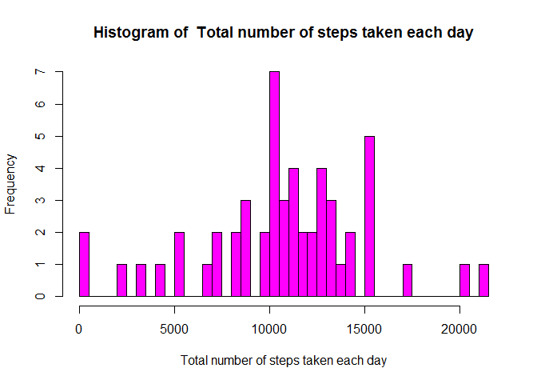
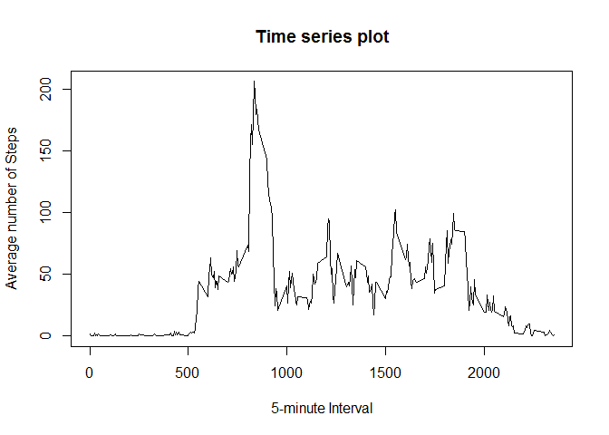
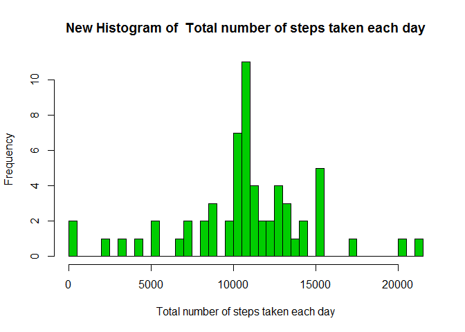

# Reproducible Research: Peer Assessment 1

  
## Loading and preprocessing the data
  

```r
library(dplyr)
```

```
## 
## Attaching package: 'dplyr'
## 
## The following object is masked from 'package:stats':
## 
##     filter
## 
## The following objects are masked from 'package:base':
## 
##     intersect, setdiff, setequal, union
```

```r
library(graphics)
library(lattice)

d <- read.csv(unz("activity.zip", "activity.csv"))
```

***

  
## What is mean total number of steps taken per day?
  
  
####Calculating the total number of steps taken per day
  

```r
steps_per_day <- d %>% na.omit() %>% group_by(date) %>% summarize(TotalSteps=sum(steps))
```
  
  
####Making a histogram of the total number of steps taken each day
  

```r
xname=c("Total number of steps taken each day")

hist(steps_per_day$TotalSteps, breaks=40, xlab= xname, main=paste("Histogram of ", xname), col=6)
```

 
  
  
####Calculating and reporting the mean and median of the total number of steps taken per day
  

```r
Mean_TotalSteps <- mean(steps_per_day$TotalSteps)
Median_TotalSteps <- median(steps_per_day$TotalSteps)
```
  
> _Mean of total number of steps taken per day is 1.0766189\times 10^{4}_
  
> _Median of total number of steps taken per day is 10765_
  
***
  
  
## What is the average daily activity pattern?
  
  
####Making a time series plot (i.e. type = "l") of the 5-minute interval (x-axis) and the average number of steps taken, averaged across all days (y-axis)
   

```r
time_series <- d %>% na.omit %>% group_by(interval) %>% summarize(average_steps=mean(steps))

plot(time_series$interval, time_series$average_steps, type="l", main="Time series plot", xlab="5-minute Interval", ylab="Average number of Steps")
```

 
  
  
####Which 5-minute interval, on average across all the days in the dataset, contains the maximum number of steps?
   

```r
Int <- time_series$interval[which(time_series$average_steps == max(time_series$average_steps))]
```
  
> _835 is the 5-minute Interval which contains the maximum number of steps_
  
***
  

## Imputing missing values
  
  
####Calculating and reporting the total number of missing values in the dataset
  

```r
number_of_missing_values <- d %>% summarise(sum(is.na(steps)))
```
  
> _Number of missing values in the dataset are 2304_
  
  
####Devising a strategy for filling in all of the missing values in the dataset
   

```r
d_new <- d

d_new <- full_join(d_new,time_series, by="interval")
```
   
  
####Creating a new dataset that is equal to the original dataset but with the missing data filled in with average steps of that interval
   

```r
d_new$steps <- ifelse(is.na(d_new$steps)==TRUE, d_new$average_steps, d_new$steps)
```
   
  
####Making a histogram of the total number of steps taken each day
  

```r
steps_per_day_new <- d_new %>% group_by(date) %>% summarize(TotalSteps=sum(steps))

hist(steps_per_day_new$TotalSteps, breaks=40, xlab= xname, main=paste("New Histogram of ", xname), col=3 )
```

 
   
  
####Calculating and reporting the mean and median total number of steps taken per day
  

```r
NewMean_TotalSteps <- mean(steps_per_day_new$TotalSteps)

NewMedian_TotalSteps <- median(steps_per_day_new$TotalSteps)
```
   
> _Mean of total number of steps taken per day for the newly created dataset is 1.0766189\times 10^{4}_
  
> _Median of total number of steps taken per day for the newly created dataset is 1.0766189\times 10^{4}_
  
> _These Mean and the Median values doesnot differ much from that of the Initial dataset with the missing values. So not much impact after imputing missing data_
  
***
  
  
## Are there differences in activity patterns between weekdays and weekends?
  
  
####Creating a new factor variable in the dataset with two levels - "weekday" and "weekend" indicating whether a given date is a weekday or weekend day
  

```r
d$day <- ifelse(weekdays(as.Date(d$date)) %in% c("Saturday", "Sunday"), "weekend", "weekday")
```
  
  
####Making a panel plot containing a time series plot (i.e. type = "l") of the 5-minute interval (x-axis) and the average number of steps taken, averaged across all weekday days or weekend days (y-axis)
  

```r
d_ts <- d %>% na.omit() %>% group_by(day, interval) %>% summarize(average_steps=mean(steps))
  
xyplot(d_ts$average_steps~d_ts$interval|d_ts$day, type="l", xlab="Interval", ylab="Number of steps", layout=c(1,2))
```

 
  
***
  
  
